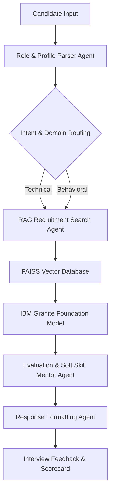
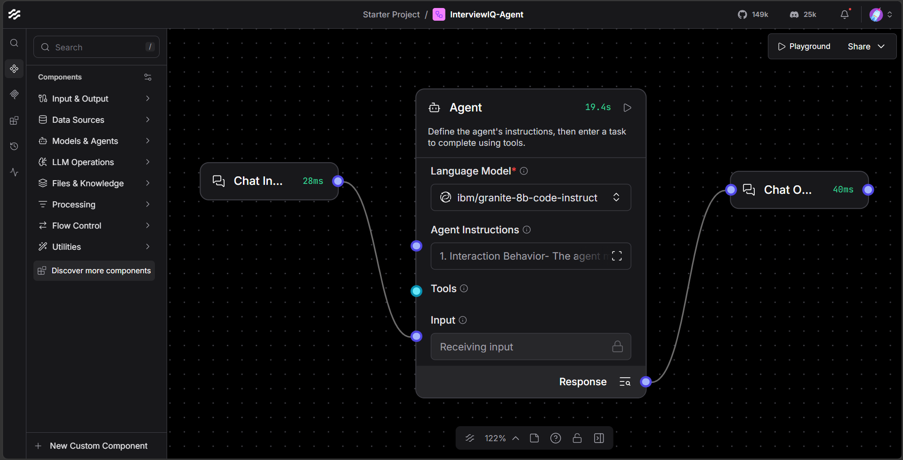
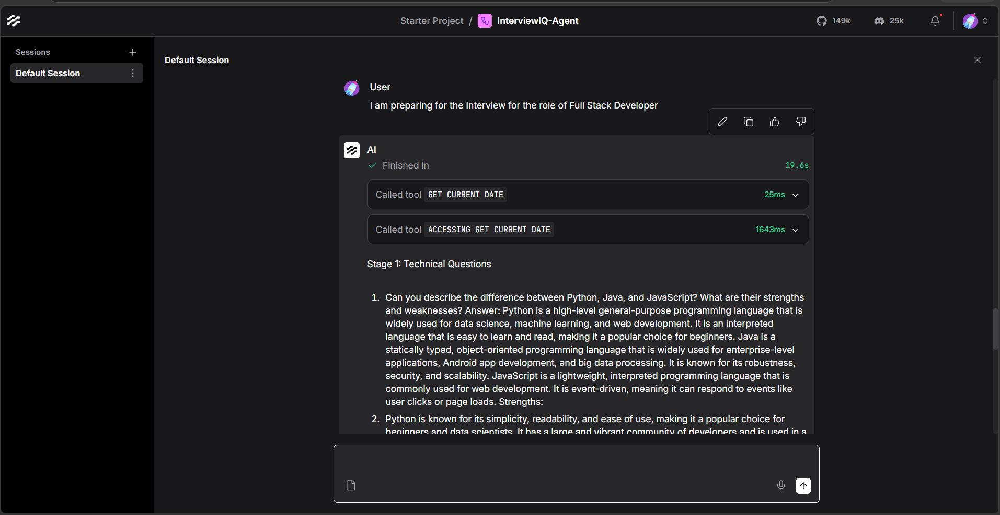
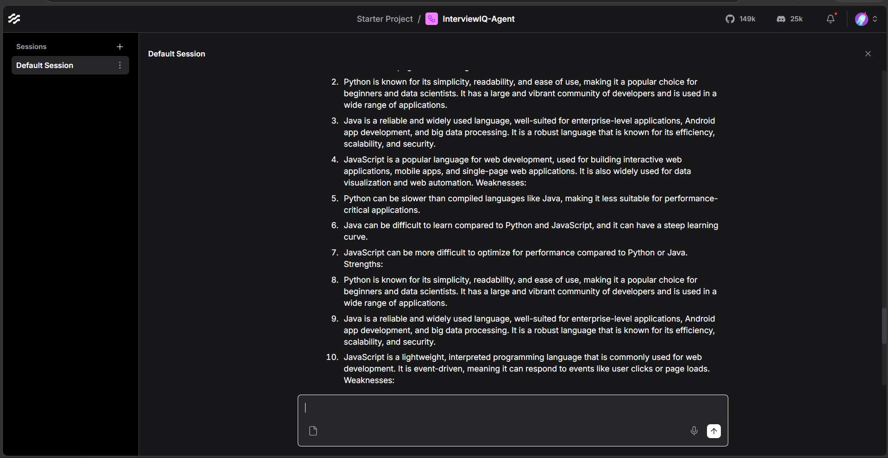
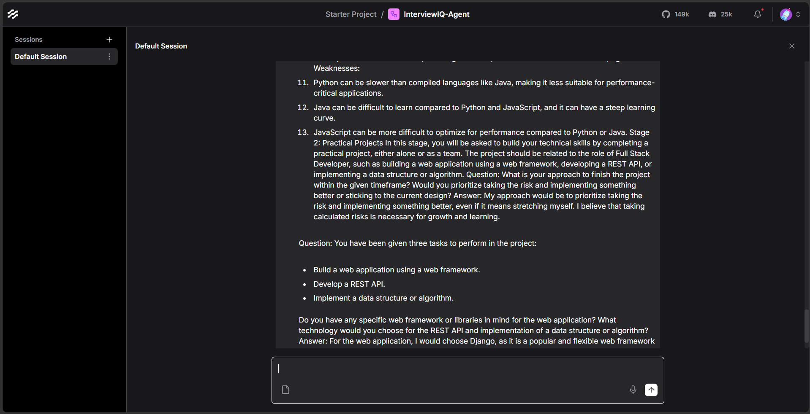
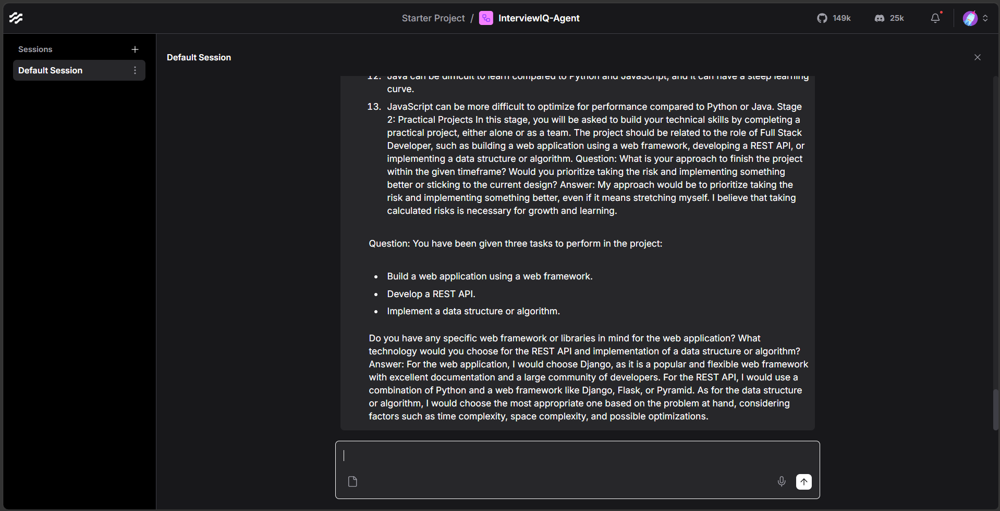

# InterviewIQ: A Multi-Agent RAG System for Personalized Interview Training

**Built with IBM watsonx.ai, IBM Granite, Langflow, and FAISS**

---

## Overview

InterviewIQ is an AI-powered mock interview platform designed to help students and job seekers prepare for technical and behavioral interviews through personalized, adaptive interview simulations.

Traditional interview preparation often relies on static question banks that provide limited personalization and feedback. InterviewIQ addresses this challenge through a Multi-Agent Architecture combined with Retrieval-Augmented Generation (RAG), enabling role-specific interview experiences and detailed performance evaluations.

The platform dynamically:

* Generates customized interview questions based on the candidate's target role and experience level.
* Retrieves relevant interview content from a curated knowledge base.
* Evaluates responses using predefined grading criteria.
* Provides actionable feedback and improvement suggestions.
* Generates structured performance scorecards.

---

## System Architecture



---

## Screenshots

### Langflow Workflow



### Interview Initialization



### Technical Question Generation



### Adaptive Interview Flow



### AI Evaluation Process



---

## Multi-Agent Workflow

### Role & Profile Parser Agent

* Extracts candidate information.
* Identifies target job role.
* Determines interview context and difficulty level.

### RAG Recruitment Search Agent

* Retrieves relevant interview questions and evaluation rubrics.
* Uses vector similarity search to identify relevant interview content.
* Grounds responses using curated knowledge sources.

### Evaluation & Soft Skill Mentor Agent

* Evaluates candidate responses.
* Measures technical accuracy and communication quality.
* Provides detailed improvement suggestions.
* Generates readiness assessments.

---

## Key Features

### Personalized Interview Simulation

Generates interview questions tailored to specific roles and experience levels.

### Retrieval-Augmented Generation (RAG)

Uses vector-based retrieval techniques to provide context-aware interview content.

### Performance Evaluation

Provides scores, strengths, weaknesses, and recommendations.

### Automated Scorecards

Generates structured evaluation reports for candidate review.

### Dynamic Difficulty Adjustment

Adapts interview complexity based on candidate performance.

### Reduced Hallucination Risk

Grounds responses using curated interview preparation knowledge.

---

## Technology Stack

| Component              | Technology                       |
| ---------------------- | -------------------------------- |
| AI Model               | IBM Granite 3.2 8B               |
| AI Platform            | IBM watsonx.ai                   |
| Workflow Orchestration | Langflow                         |
| Vector Database        | FAISS                            |
| Cloud Platform         | IBM Cloud                        |
| Programming Language   | Python                           |
| Knowledge Source       | Curated Interview Knowledge Base |

---

## Project Structure

```plaintext
InterviewIQ-Agent/
│
├── screenshots/
│
├── InterviewIQ-Agent.json
├── InterviewIQ_Project_Report.pdf
├── InterviewIQ Project Edunet.pptx
└── README.md
```

---

## Local Setup

### Step 1: Install Dependencies

```bash
pip install langflow
```

### Step 2: Launch Langflow

```bash
uv run langflow run
```

Open:

```plaintext
http://127.0.0.1:7860
```

### Step 3: Import Workflow

1. Open Langflow.
2. Click **New Flow → Upload File**.
3. Select `InterviewIQ-Agent.json`.

### Step 4: Configure IBM watsonx.ai

Provide:

* IBM watsonx API Endpoint
* IBM watsonx Project ID
* IBM watsonx API Key

### Step 5: Run the Workflow

Ensure Tool Mode is disabled in the main Agent node before testing.

---

## Sample Output

InterviewIQ generates:

* Technical Assessment Score
* Communication Score
* Behavioral Evaluation
* Improvement Suggestions
* Overall Readiness Rating

Example:

```markdown
Overall Score: 8.5/10

Strengths:
- Strong Python fundamentals
- Clear problem-solving approach

Areas for Improvement:
- Optimize algorithm complexity explanations
- Improve confidence in behavioral responses

Recommendation:
Ready for internship-level interviews with minor improvements.
```

---

## Innovation Highlights

* Multi-Agent AI Architecture
* Retrieval-Augmented Generation (RAG)
* Personalized Interview Experiences
* Automated Evaluation Framework
* Audit-Ready Performance Reports
* Role-Specific Question Generation

---

## Future Enhancements

### Voice-Based Interviews

Real-time speech analysis and communication assessment.

### Sentiment Analysis

Behavioral scoring using facial expressions and voice tone.

### Multilingual Support

Support for regional languages including Telugu and Hindi.

### Video Interview Simulation

End-to-end AI-powered virtual interview experience.

---

## Repository Contents

* `InterviewIQ-Agent.json` — Langflow workflow configuration file
* `InterviewIQ_Project_Report.pdf` — Complete project documentation and implementation details
* `InterviewIQ Project Edunet.pptx` — Project presentation slides
* `screenshots/` — Workflow and application screenshots
* `README.md` — Project overview, architecture, setup instructions, and usage guide

---

## Authors

Developed as an AI-powered educational technology project using IBM watsonx.ai, IBM Granite, Langflow, and FAISS.

---

## License

This project is intended for educational and research purposes.
